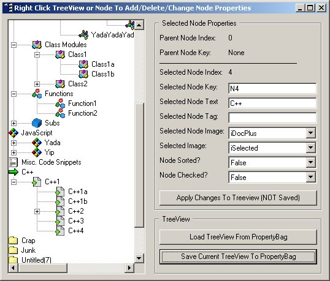



## Save/Load Treeview with Propertybag

### Description

Update: Ver 1.0.1 29 Feb. 2008

Drop modTVpropbag.bas into your project and you can save and restore treeviews with 2 simple calls. This is as close to "plug-n-play" as it gets... even a very new newbie can make this work in minutes.

I include a demo project for your perusal.

Supports multiple treeviews (easily modified to work with other controls). Saves and restores:

Nodes/child nodes, Node.Key, Node.Tag, Icons, Expanded state, sorted state, checked state. What else could you want for nothin'?

Version 1.0.1 implements the .tag property (per request) and is considerably cleaner/optimized code.

Appreciate your comments most.
 
### More Info
 
Treeview name

See readme... easy to implement.

Saves or restores treeview contents/states

             |
---                |---
**Submitted On**   |2008-02-29 20:56:22
**By**             |[CptnVic](https://github.com/Planet-Source-Code/PSCIndex/blob/master/ByAuthor/cptnvic.md)
**Level**          |Intermediate
**User Rating**    |5.0 (25 globes from 5 users)
**Compatibility**  |VB 6\.0
**Category**       |[Miscellaneous](https://github.com/Planet-Source-Code/PSCIndex/blob/master/ByCategory/miscellaneous__1-1.md)
**World**          |[Visual Basic](https://github.com/Planet-Source-Code/PSCIndex/blob/master/ByWorld/visual-basic.md)
**Archive File**   |[Save\_Load\_2104192292008\.zip](https://github.com/Planet-Source-Code/cptnvic-save-load-treeview-with-propertybag__1-70056/archive/master.zip)

